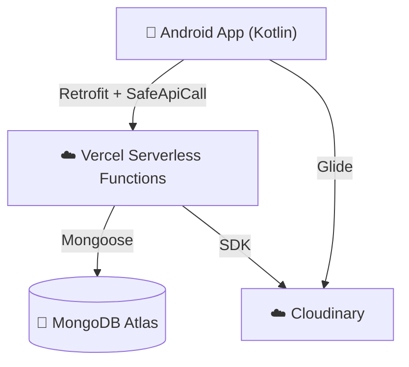

# Ajicolor E-commerce: Plataforma de venta de ropa urbana con Arquitectura Serverless


Plataforma integral de comercio electrónico diseñada para alta disponibilidad y seguridad, integrando una aplicación nativa Android con un backend Serverless distribuido.

## 🏗️ Arquitectura Técnica

El sistema utiliza una arquitectura desacoplada optimizada para la nube:



-   **Frontend:** Android Nativo (Kotlin) con arquitectura MVVM, Coroutines y Jetpack Compose/XML.
-   **Backend:** Node.js + Express desplegado en Vercel (Serverless).
-   **Base de Datos:** MongoDB Atlas (Cluster M0).
-   **Media:** Cloudinary para almacenamiento y optimización de imágenes.

## 🚀 Características Clave

### 🔒 Seguridad & "Zero-Trust"
-   **Zero-Trust Local Storage:** Eliminación total de almacenamiento de contraseñas en el dispositivo (`UserEntity` sanitizado).
-   **Sanitización de Datos:** Middleware `express-mongo-sanitize` y `helmet` en el backend.
-   **Validación Estricta:** Uso de `express-validator` en todos los endpoints de autenticación.

### ☁️ "Smart Migration" (Legacy a Cloud)
Sistema automatizado de migración de datos implementado para la transición desde infraestructura legacy:
-   **ETL Script:** `migrateWithCloudinary.js` extrae datos hardcodeados y recursos locales.
-   **Cloud Upload:** Carga automática de imágenes a Cloudinary con deduplicación.
-   **Resultado:** 28 productos migrados exitosamente con integridad referencial.

### ⚡ Resiliencia de Red
-   **Manejo de Cold-Starts:** Cliente Android optimizado con timeouts extendidos (60s) y lógica de reintento (`retryInterceptor`) para soportar la naturaleza "dormida" de las funciones serverless.
-   **SafeApiCall:** Wrapper genérico en Android para manejar errores de red y respuestas HTML inesperadas (Bad Gateway) de forma graciosa.

## 🛠️ Instalación y Configuración

### Prerrequisitos
-   Node.js v18+
-   Android Studio Koala+
-   Cuenta en MongoDB Atlas y Cloudinary

### 1. Configuración del Backend

Clonar el repositorio y navegar al backend:
```bash
cd "app poleras/Backend"
npm install
```

Crear archivo `.env` en `app poleras/Backend/.env`:
```properties
PORT=3000
MONGO_URI=mongodb+srv://<usuario>:<password>@cluster.mongodb.net/BDAjicolor
JWT_SECRET=tu_secreto_super_seguro
NODE_ENV=development

# Cloudinary
CLOUDINARY_CLOUD_NAME=tu_cloud_name
CLOUDINARY_API_KEY=tu_api_key
CLOUDINARY_API_SECRET=tu_api_secret
```

Ejecutar en desarrollo:
```bash
npm run dev
```

### 2. Configuración de Android
1.  Abrir `App_Ajicolor` en Android Studio.
2.  Sincronizar Gradle.
3.  Verificar `build.gradle.kts` para la URL base:
    ```kotlin
    buildConfigField("String", "BASE_URL", "\"https://tu-app.vercel.app/\"")
    ```

## 🧪 Scripts de Utilidad
El proyecto incluye herramientas para mantenimiento en `Backend/scripts`:
-   `npm run migrate`: Ejecuta la migración de productos legacy.
-   `node verifyCloudinaryUrls.js`: Audita que todas las imágenes apunten a la CDN.
-   `node resetDatabase.js`: **[PELIGRO]** Limpia la base de datos preservando admins.

## 👥 Créditos
Desarrollado utilizando las mejores prácticas de la industria:
-   **Android:** Retrofit, OkHttp, Coroutines, Hilt (DI).
-   **Backend:** Express, Mongoose, Morgan, Dotenv.
-   **Infraestructura:** Vercel, MongoDB Atlas, Cloudinary.
